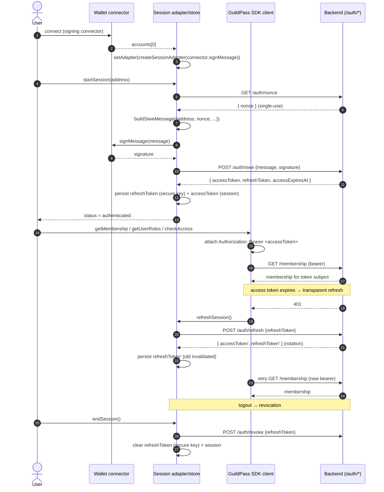

# SIWE-Based Session Architecture

Status: implemented · Difficulty: Expert · Type: security / feature

## Problem

Before this change, the app trusted whatever wallet address the client claimed to
be connected to. `useMembership` and `useAccessCheck` passed a raw
`walletAddress` straight to `@guildpass/sdk`, and the SDK sent it to the backend
with no proof the client controlled that address. A malicious or modified build
could therefore query membership / role data for **arbitrary addresses it did not
own**.

This change introduces a **proven session**: the user signs a Sign-In With
Ethereum (EIP-4361) message, the signature is exchanged for a short-lived access
token plus a rotating refresh token, and every subsequent SDK call is
authenticated by that session — not by a client-asserted address.

## Affected files

| Concern | Path |
| --- | --- |
| SIWE message build/parse (pure, deterministic) | `src/features/auth/siwe.ts`, `siwe.types.ts` |
| Token-exchange client (`/auth/*`) | `src/features/auth/authClient.ts`, `authClient.types.ts`, `authClientInstance.ts` |
| Bearer + 401 silent-refresh fetch | `src/features/auth/authFetch.ts` |
| SIWE session adapter | `src/features/session/siweSessionAdapter.ts` |
| Refresh-token secure storage | `src/features/session/refreshTokenStorage.ts` |
| Session store (token model, rotation) | `src/features/session/session.store.ts`, `session.types.ts`, `useSession.ts`, `createSessionAdapter.ts` |
| Wallet signing capability | `src/features/wallet/walletConnector.types.ts`, `walletConnector.service.ts` |
| Authenticated SDK client | `src/lib/guildpassClient.ts` |
| Session-bound queries | `src/features/membership/useMembership.ts`, `src/features/access/useAccessCheck.ts` |
| SDK `auth` contract | `src/types/guildpass-sdk.d.ts` |

## Flow

## Security properties

1. **No bare-address trust.** User-scoped queries (`getMembership`,
   `getUserRoles`, `checkAccess`) take the address from the **proven session**
   (`session.walletAddress`). A query for an address that differs from the
   authenticated session is rejected client-side
   (`assertSessionAddress` in `useMembership.ts`, `resolveSessionAddress` in
   `useAccessCheck.ts`). The server authorizes from the verified bearer token,
   not the request body.

2. **Nonce replay protection.** The server issues a single-use nonce embedded in
   the signed SIWE message. A replayed or forged nonce fails exchange.

3. **Refresh-token rotation.** Every `/auth/refresh` returns a new refresh token;
   the old one is invalidated server-side. The client overwrites the stored
   refresh token on each refresh, so a stolen refresh token has a one-shot
   window.

4. **Revocation on logout.** `endSession()` calls the adapter's `signOut()`,
   which `POST /auth/revoke`s the stored refresh token and clears it locally.
   Revocation is best-effort: local clearing always runs even if the network call
   fails.

5. **Isolated sensitive storage.** The refresh token lives in its own
   `expo-secure-store` key (`session-refresh-token`), separate from the zustand
   session JSON (which holds only the access token). It is never serialized
   alongside less-sensitive state.

6. **Transparent refresh on expiry.** `createAuthenticatedFetch` attaches the
   bearer and, on a `401` with a live token, performs exactly one refresh + retry.
   A failed refresh surfaces the original `401` and flips the session to
   `expired` + `reAuthRequired`, prompting re-auth in the UI — no loop, no
   user-visible interruption in the common case.

## SDK coordination

`@guildpass/sdk` has no `auth` namespace yet (its read methods take a raw
`walletAddress`). This change implements the same contract in-app via
`AuthClient` (`/auth/{nonce,siwe,refresh,revoke}`), and declares the intended
`client.auth` shape — `getNonce`, `exchangeSiwe`, `refresh`, `revoke`, `TokenPair`
— in `src/types/guildpass-sdk.d.ts`. When the SDK ships SIWE support, swapping
the mobile's `AuthClient` for `guildPassClient.auth.*` is a drop-in; the request
and response shapes already match.

## Manual / testing notes

There is no live backend in this repo. The transport is injectable, so all auth
flows are exercised against a mock `fetch` in unit tests, and the full
rotate/revoke chain is asserted end-to-end against an in-memory fake backend in
`tests/evals/siwe-session.eval.ts`. Gate tests: `tests/siwe.test.ts`,
`tests/authClient.test.ts`, `tests/authFetch.test.ts`,
`tests/siweSessionAdapter.test.ts`, `tests/refreshTokenStorage.test.ts`,
`tests/session-refresh-rotation.test.ts`, `tests/session-and-connector.test.ts`,
`tests/hooks/useMembershipSession.test.ts`.
